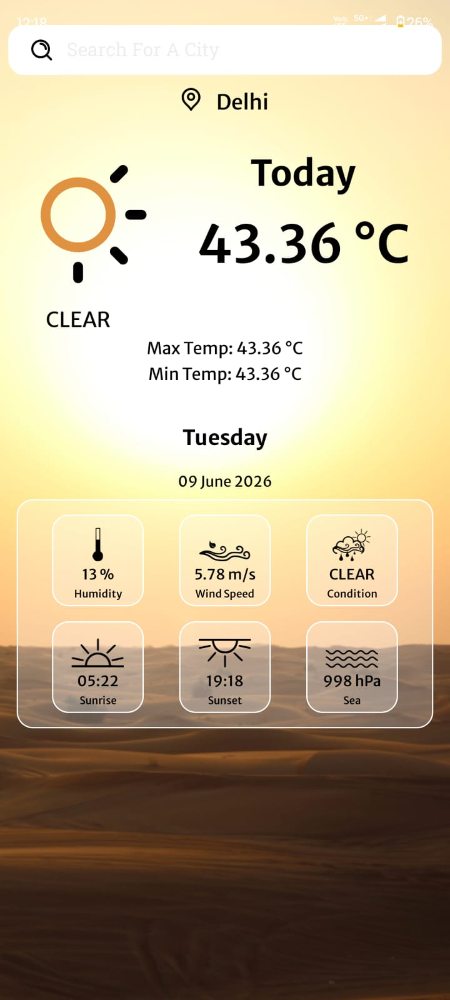
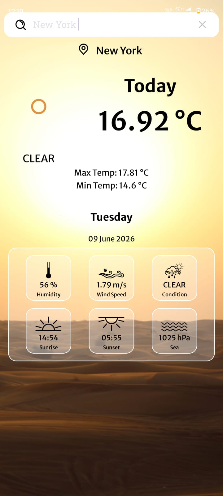
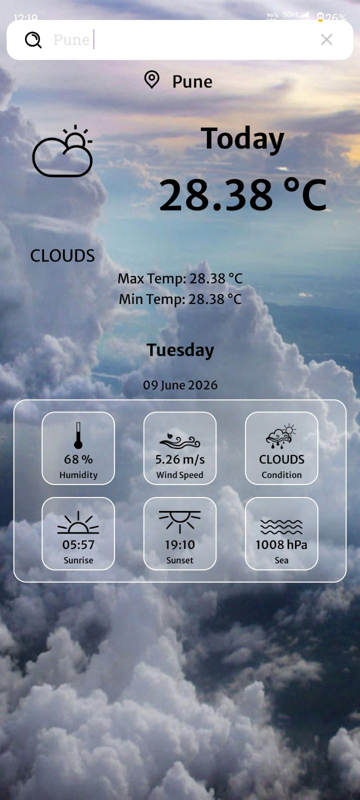

# 🌦️ Weather App

Weather App is an Android application built using Kotlin and REST APIs that provides real-time weather information for locations around the world. 
The app allows users to search any city and view current temperature, humidity, and weather conditions through a clean and responsive interface.

## Features

* Real-Time Weather Updates
* Search Weather by City Name
* Current Temperature Display
* Humidity Information
* Weather Condition Details
* Atmospheric Information
* REST API Integration
* Fast and Smooth Performance
* Clean and User-Friendly Interface
* Material Design UI

## Technologies Used

* Kotlin
* Android Studio
* Retrofit
* REST API
* XML Layouts
* Material Components

## 📸 Screenshots

### Splash Screen

### Home Screen

### Search City Screen

### Weather Details Screen

## Project Architecture

* Activities
* Adapters
* Models
* API Services
* Utility Classes

## Installation

1. Clone the repository.
2. Open the project in Android Studio.
3. Add your Weather API key.
4. Sync Gradle files.
5. Run the application on an emulator or Android device.

## Usage

1. Open the application.
2. Enter the name of any city.
3. View live weather information instantly.
4. Check temperature, humidity, and weather conditions in real time.

## Future Enhancements

* Current Location Weather
* 7-Day Weather Forecast
* Dark Mode Support
* Favorite Cities
* Weather Notifications

## Author

**Yash Raj**

Android Developer
